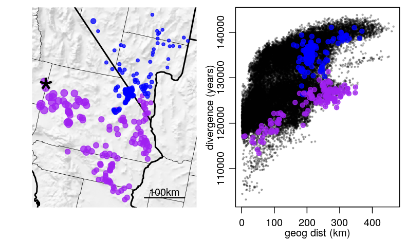
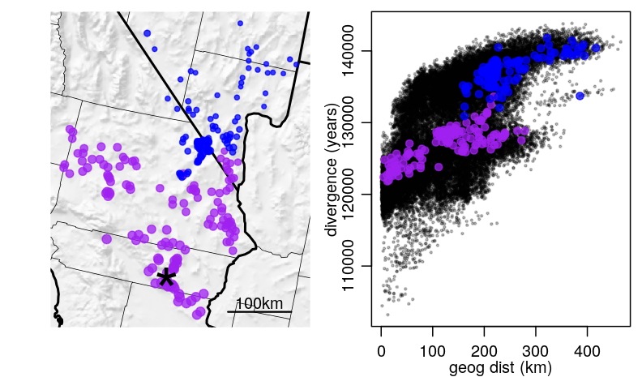
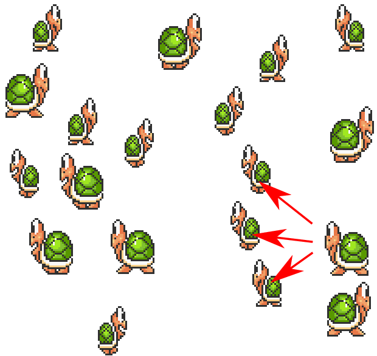

# Geography

## Waldo Tobler's First Law

> Everything is related to everything else, but near things are more related than distant things.

## 

$$ \text{Wright-Fisher} + \text{geography} $$

. . .

$$ \qquad {} = \text{a pain in the torus} $$

. . .

*Felensestein, 1975*

## The pain

<video width="600" height="600" controls>
  <source src="figs/pain.500.anim.mp4" type="video/mp4">
</video>

## A related pain

**Coalescent theory** requires *random mating* in large populations,
because:

> 1. Lineages must move *independently* until the coalesce, and
> 2. if we know one offspring came from a certain location,
> 3. that location may be more likely to be the source of others.

. . .

::: {.columns}
::::::: {.column width="25%"}

{width=90%}

:::
::::::: {.column width="75%"}

We need **forward simulation** for realistic geography.

:::
:::::::

## The promise

Geography could add a *lot* of information.

. . .

With $n$ samples and no geography, there are $n$ informative entries in the SFS.

. . .

With georeferenced data, each of the $n(n-1)/2$ different pairwise divergences
provide different information.

-------------

-------------

-------------

-------------

-------------

-------------

-------------

-------------

-------------

-------------

-------------

-------------

# Modeling

## 

The earth is not flat.

. . .

barriers, currents, microclimates ...

##

Population regulation is **local**.

. . .

That means the Wright-Fisher model is *right out*.

## Interactions

::: {.columns}
::::::: {.column width="50%"}

Based on *interaction kernels*, e.g.
$$
    \rho(r) = \frac{1}{2 \pi \sigma^2} e^{- r^2 / 2 \sigma^2}
$$

applied to the distance to the other individual.

:::
::::::: {.column width="50%"}

{width=100%}

:::
:::::::

## Interactions

::: {.columns}
::::::: {.column width="50%"}

Based on *interaction kernels*, e.g.
$$
    \rho(r) = \frac{1}{2 \pi \sigma^2} e^{- r^2 / 2 \sigma^2}
$$

applied to the distance to the other individual.

:::
::::::: {.column width="50%"}

{width=100%}

:::
:::::::

##  

::: {.columns}
::::::: {.column width="50%"}

1. **Mate choice:** 

    individual $i$ chooses partner $j$ at distance $d_{ij}$ 
    with probability proportional to $\rho(d_{ij})$.

:::
::::::: {.column width="50%"}

{width=100%}

:::
:::::::

##  

::: {.columns}
::::::: {.column width="50%"}

2. **Dispersal:** 

    offspring live near their parents.

:::
::::::: {.column width="50%"}

{width=100%}

:::
:::::::

##  

::: {.columns}
::::::: {.column width="50%"}

3. **Population regulation:**

    with local density
    $$ D_i = \sum_j \rho(d_{ij}) , $$

    - *survival*, 
    - *fecundity*, and/or 
    - *establishment* 

    decrease with $D$.

:::
::::::: {.column width="50%"}

{width=100%}

:::
:::::::

## Computation

To do this, we need to know
$$ \rho(\|x_i - x_j\|) $$
for each pair $(i,j)$ of individuals.

. . .

This is...

. . .

*(cue dramatic music)*

. . .

$$ O(N^2) $$

## Computation

To do this, we need to know
$$ \rho(\|x_i - x_j\|) $$
for each pair of **nearby** individuals.

. . .

... say, for all pairs with $\|x_i - x_j\| \le 3 \sigma$.

. . .

A $k$-d tree

: allows finding all points within distance $3\sigma$ in $\log(N)$-time.

Computation time scales with $N M \log(N)$, 
where $M$ is the number of neighbors within distance $3\sigma$.

## Can we do all this yet?

::: {.columns}
::::::: {.column width="50%"}

**Yes!!** 

In SLiM v3.1:

- nonWF models
- spatial interactions
- geographic maps
- tree sequence recording

See Philipp's poster!

Next: heterogeneous dispersal?

:::
::::::: {.column width="50%"}

Haller & Messer 2018: SLiM v3.1

Haller, Galloway, kelleher, Messer & Ralph 2018 bioRxiv:407783 

:::
:::::::

# But does it matter?

## 

::: {.columns}
::::::: {.column width="50%"}

{width=80%}

CJ Battey

:::
::::::: {.column width="50%"}

{width=80%}

Andy Kern

:::
:::::::

## Simulations

> 1. Flat, square habitat.
> 2. Neutral.
> 3. Mate choice: proportional to $e^{-d_{ij}^2 /2 \sigma_m^2}$.
> 4. Poisson(1/4) offspring each time step.
> 5. ... which disperse a Normal$(0, \sigma_d)$ distance.
> 6. Local density for $i$ computed as:
>     $$ D_i = \frac{1}{2 \pi \sigma_i^2} \sum_{j \neq i} e^{-d_{ij}^2 /2 \sigma_i^2} , $$
> 7. Probability of survival: with $K=5$,
>     $$ \min(0.95, 1/(1 + D_i / 5 K) . $$
> 8. $10^8$ bp with recomb rate $10^{-9}$; neutral mutations on the tree sequence after.

## $\sigma_d = \sigma_i = \sigma_m = 2$

<video width="600" height="600" controls>
  <source src="figs/flat.500.anim.mp4" type="video/mp4">
</video>

## $\sigma_d = \sigma_i = \sigma_m = 2$

::: {.columns}
::::::: {.column width="50%"}

{width=600}

:::
::::::: {.column width="50%"}

:::
:::::::

## $\sigma_d = 0.15$, $\sigma_i = \sigma_m = 0.5$

<video width="600" height="600" controls>
  <source src="figs/metapops.500.anim.mp4" type="video/mp4">
</video>

## $\sigma_d = 0.15$, $\sigma_i = \sigma_m = 0.5$

::: {.columns}
::::::: {.column width="50%"}

{width=600}

:::
::::::: {.column width="50%"}

:::
:::::::

## $\sigma_d = 0.25$, $\sigma_i = \sigma_m = 0.2$

<video width="600" height="600" controls>
  <source src="figs/patchy.500.anim.mp4" type="video/mp4">
</video>

## $\sigma_d = 0.25$, $\sigma_i = \sigma_m = 0.2$

::: {.columns}
::::::: {.column width="50%"}

{width=600}

:::
::::::: {.column width="50%"}

:::
:::::::

## Nice pictures, but Does it *actually* matter?

- We varied *one* parameter, $\sigma_d = \sigma_i = \sigma_m$.

- Comparison: nonspatial mate choice.

- If well-mixed, mean density is $K=5$ individuals per unit square.

- Run times: $\approx$ 1h for 1000 diploids with $10^8$ bp at $\sigma=2$,
    recombination rate $10^{-9}$, for 200K time steps.

## Approach to equilibrium

## Popgen stats

## The site frequency spectrum

## The site frequency spectrum

# Wrap-up

## 

> 1. Geography is interesting! We want to know about it!
> 
> 2. Also, geographic structure affects our data, maybe strongly.
> 
> 3. This is good! (a source of information)
> 
> 4. And also bad. (inference is more complicated)
> 
> 5. But!!  We can now simulate it!
> 
> 6. Another complication: changes with time.

##

Thank you!!
